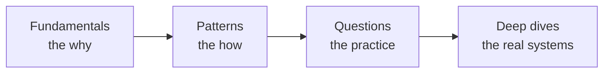

# Fundamentals: the concepts under the patterns

Before you assemble a system out of [patterns](../patterns/), it helps to understand the forces those patterns exist to balance: latency, throughput, availability, consistency, and cost. This track is the conceptual on-ramp. Read it once end to end, and the trade-offs behind every design decision start to feel obvious.

Where a [pattern](../patterns/) tells you *how* to do something in an interview, a fundamental tells you *why* and *when*. The two are meant to be read together — each page below links to the patterns that put the idea into practice.

## Suggested reading order

1. [Performance vs scalability](performance-vs-scalability.md) — two different problems people conflate.
2. [Latency vs throughput](latency-vs-throughput.md) — the two numbers every design is judged on.
3. [Availability vs consistency](availability-vs-consistency.md) — CAP and PACELC in plain language.
4. [Consistency patterns](consistency-patterns.md) — weak, eventual, and strong.
5. [Availability patterns](availability-patterns.md) — fail-over, replication, and the "nines."
6. [DNS](dns.md) — how a name becomes a connection.
7. [Reverse proxy vs load balancer](reverse-proxy-vs-load-balancer.md) — two boxes that look alike.
8. [Application layer](application-layer.md) — services, microservices, and service discovery.
9. [Databases](databases.md) — RDBMS scaling, and the NoSQL families.
10. [Asynchronism](asynchronism.md) — queues, workers, and back pressure.
11. [Communication](communication.md) — HTTP, TCP, UDP, RPC, and REST.
12. [Security](security.md) — the baseline every design should mention.

## How the fundamentals map to the patterns

| Fundamental | Put into practice by |
|-------------|----------------------|
| [Availability vs consistency](availability-vs-consistency.md) | [CAP theorem](../patterns/cap-theorem.md), [consistency models](../patterns/consistency-models.md) |
| [Consistency patterns](consistency-patterns.md) | [Quorum](../patterns/quorum.md), [replication](../patterns/replication.md) |
| [Availability patterns](availability-patterns.md) | [Replication](../patterns/replication.md), [leader election](../patterns/leader-election.md), [heartbeats](../patterns/heartbeats.md) |
| [Reverse proxy vs load balancer](reverse-proxy-vs-load-balancer.md) | [Load balancing](../patterns/load-balancing.md), [proxies](../patterns/proxies.md), [API gateway](../patterns/api-gateway.md) |
| [Application layer](application-layer.md) | [API gateway](../patterns/api-gateway.md), [circuit breaker](../patterns/circuit-breaker.md) |
| [Databases](databases.md) | [Sharding and partitioning](../patterns/sharding-partitioning.md), [database indexing](../patterns/database-indexing.md), [consistent hashing](../patterns/consistent-hashing.md) |
| [Asynchronism](asynchronism.md) | [Message queues](../patterns/message-queues.md), [batch vs stream processing](../patterns/batch-vs-stream-processing.md) |
| [Communication](communication.md) | [Long polling vs WebSockets vs SSE](../patterns/long-polling-websockets-sse.md), [rate limiting](../patterns/rate-limiting.md) |

## Where this fits

Once these are intuitive, move on to the [core patterns](../patterns/), then practice with the [question catalog](../questions/), and see the ideas at planet scale in the [deep dives](../deep-dives/).

## Go deeper

- Read more (free): [25 Fundamental System Design Concepts](https://www.designgurus.io/blog/system-design-interview-fundamentals)
- Start from zero: [Grokking System Design Fundamentals](https://www.designgurus.io/course/grokking-system-design-fundamentals)
- Full course: [Grokking the System Design Interview](https://www.designgurus.io/course/grokking-the-system-design-interview)
