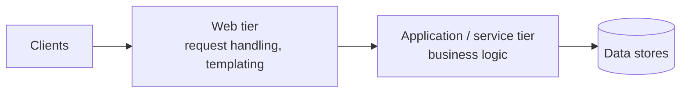
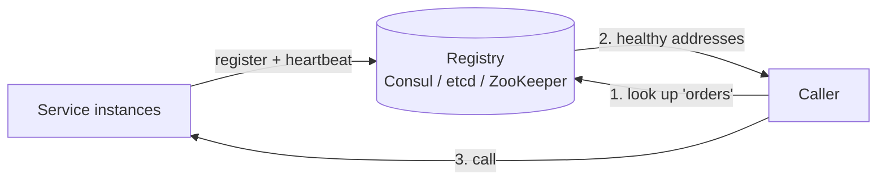

# The application layer

> Separating the web tier (handles requests) from the application/service tier (runs business logic) lets you scale, deploy, and reason about each independently. Taken far enough, this becomes microservices — with service discovery to glue them back together.

## Separate the web and application tiers

The simplest useful split is to pull business logic out of the web servers into their own tier:

Why bother? Each tier now scales on its own axis. A traffic spike that needs more web servers doesn't force you to also scale the CPU-heavy application logic, and vice versa. It also gives you a clean seam to keep the web tier **stateless** (so it scales out trivially) while state lives behind the application tier.

## Monolith → microservices

- A **monolith** puts all functionality in one deployable unit. It's simple to build, test, and deploy early on, and it stays the right choice for many products. The pain shows up at scale: one small change redeploys everything, one memory leak can take down unrelated features, and teams step on each other.
- **Microservices** split the system into small, independently deployable services, each owning one capability and its data. This buys independent scaling, independent deploys, fault isolation, and team autonomy — at the cost of network calls, distributed-systems complexity, and operational overhead.

| | Monolith | Microservices |
|--|----------|---------------|
| Deploy | One unit | Many independent units |
| Scaling | Whole app together | Per service |
| Failure blast radius | Whole app | Ideally one service |
| Complexity | In the code | In the network and operations |
| Best when | Early stage, small team, unclear boundaries | Clear boundaries, many teams, differing scale needs |

Don't reach for microservices by default. Split when you have a real reason — divergent scaling, independent release cadence, or team boundaries — and let the seams follow business capabilities. See [SOA vs monolith vs microservices](https://www.designgurus.io/blog/monolithic-service-oriented-microservice-architecture).

## Service discovery

Once services are independent and each runs many instances that come and go (autoscaling, deploys, failures), a caller can't hardcode addresses. **Service discovery** answers "where is a healthy instance of service X right now?"

- Instances **register** on startup and send [heartbeats](../patterns/heartbeats.md); the registry drops the ones that stop reporting.
- **Client-side discovery**: the caller queries the registry and picks an instance.
- **Server-side discovery**: the caller hits a [load balancer](../patterns/load-balancing.md) or [API gateway](../patterns/api-gateway.md) that consults the registry for it.
- Registries like [ZooKeeper](../deep-dives/zookeeper-coordination.md), etcd, and Consul provide the consistent, highly available store this needs.

## Holding it together

Microservices need supporting patterns to stay reliable: an [API gateway](../patterns/api-gateway.md) as the single entry point, [circuit breakers](../patterns/circuit-breaker.md) to stop cascading failures, [idempotency](../patterns/idempotency.md) for safe retries, and [message queues](../patterns/message-queues.md) to decouple services that shouldn't block on each other.

## Go deeper

- Read more (free): [19 Essential Microservices Patterns](https://www.designgurus.io/blog/19-essential-microservices-patterns-for-system-design-interviews)
- Related pattern: [API gateway](../patterns/api-gateway.md), [circuit breaker](../patterns/circuit-breaker.md)
- Full course: [Grokking the System Design Interview](https://www.designgurus.io/course/grokking-the-system-design-interview)
