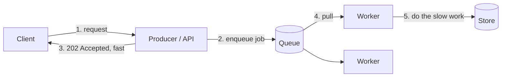

# Asynchronism

> When work is slow or spiky, don't make the user wait for it. Accept the request, put the work on a queue, and let background workers process it. This smooths spikes, decouples services, and keeps the user-facing path fast.

## Why go async

Some work is too slow to do inside a request (encoding a video, sending a million notifications, generating a report) or too spiky to do synchronously (a flash sale). Asynchronism moves that work off the request path:

The API returns immediately (often `202 Accepted` with a job ID the client can poll or get notified about), and workers do the heavy lifting on their own schedule.

## Message queues vs task queues

- A **message queue** buffers and delivers messages between producers and consumers, decoupling them in time and rate. Producers don't wait for consumers; consumers process at their own pace. Examples: [Kafka](../deep-dives/kafka-distributed-messaging.md), RabbitMQ, SQS. See the [message queues pattern](../patterns/message-queues.md).
- A **task queue** is a message queue specialized for background jobs: it carries tasks plus metadata (retries, scheduling, priorities) and a worker framework that runs them. Examples: Celery, Sidekiq, a job runner on top of Redis or SQS.

The benefits: **decoupling** (services don't call each other directly), **spike absorption** (the queue buffers a burst so the backend processes at a steady rate), **retries** (a failed job goes back on the queue), and **independent scaling** (add workers without touching producers).

## Back pressure

A queue is a buffer, not infinite storage. If producers consistently outpace consumers, the queue grows without bound — memory fills, latency balloons, and eventually things crash. **Back pressure** is the system pushing back so producers slow down instead of overwhelming it:

- **Bound the queue** and reject or shed load when full (return `429 Too Many Requests` or `503`, and let clients retry with backoff).
- **Rate-limit** producers at the edge — see [rate limiting](../patterns/rate-limiting.md).
- **Scale consumers** (autoscale workers on queue depth) so the buffer drains.
- **Degrade gracefully** — drop low-priority work, serve cached results.

Always monitor **queue depth** and **consumer lag**. A steadily growing queue is an early warning that consumers can't keep up.

## What to watch for

- **Ordering**: most queues don't guarantee global order; design consumers to tolerate out-of-order delivery, or use per-key partitions.
- **At-least-once delivery**: messages can be delivered more than once, so consumers must be [idempotent](../patterns/idempotency.md).
- **Poison messages**: a job that always fails will retry forever — send it to a **dead-letter queue** after N attempts.
- **Visibility of failures**: async errors don't surface to the user, so you need good monitoring and alerting.

## Go deeper

- Related pattern: [Message queues](../patterns/message-queues.md), [batch vs stream processing](../patterns/batch-vs-stream-processing.md), [rate limiting](../patterns/rate-limiting.md)
- Deep dive: [Kafka](../deep-dives/kafka-distributed-messaging.md)
- Full course: [Grokking the System Design Interview](https://www.designgurus.io/course/grokking-the-system-design-interview)
