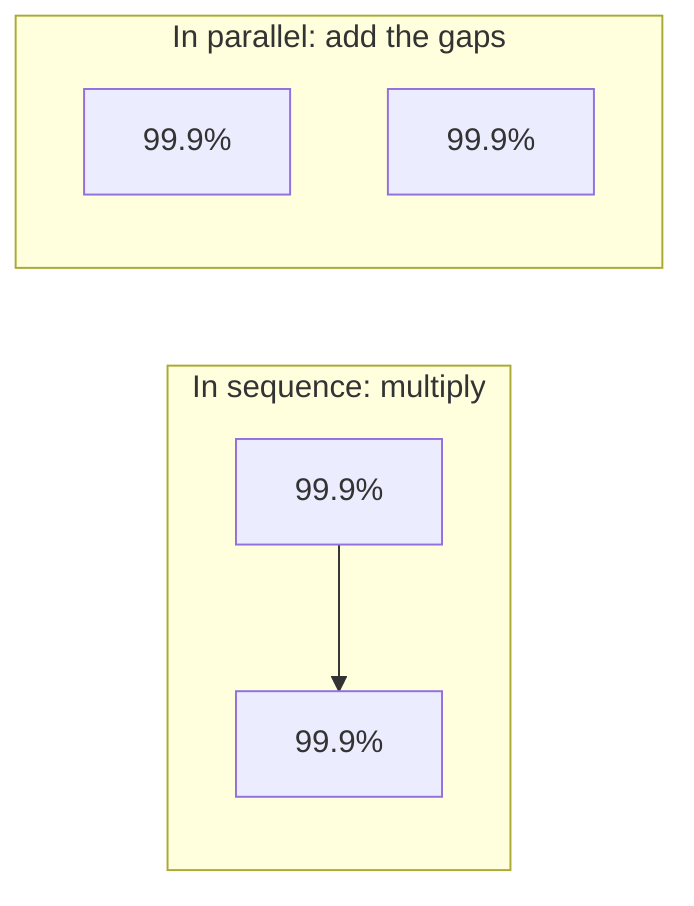

# Availability patterns

> Availability is the fraction of time a system can serve requests. You raise it by removing single points of failure — through fail-over and replication — and you measure it in "nines."

## Availability in numbers: the "nines"

Availability is usually quoted as a percentage of uptime. Each additional nine cuts the allowed downtime by 10×:

| Availability | "Nines" | Downtime per year | Per month | Per day |
|-------------|---------|-------------------|-----------|---------|
| 99% | two nines | 3.65 days | 7.2 hours | 14.4 min |
| 99.9% | three nines | 8.77 hours | 43.8 min | 1.44 min |
| 99.99% | four nines | 52.6 min | 4.38 min | 8.6 s |
| 99.999% | five nines | 5.26 min | 26.3 s | 864 ms |

Two lessons: (1) the jump from three to five nines is enormous in engineering effort and cost — justify the target, don't default to "five nines." (2) Downtime budgets are small; a single bad deploy can blow a month's budget in minutes.

### Availability of a whole system

Components combine differently depending on how they're wired:

- **In sequence** (a request must pass through both): availability multiplies. Two 99.9% components in series give `0.999 × 0.999 ≈ 99.8%` — *lower* than either alone. Every hop you add lowers availability.
- **In parallel** (either can serve the request): availability rises. Two 99.9% components in parallel give `1 − (0.001 × 0.001) = 99.9999%`. Redundancy is how you buy nines.

## Fail-over

Keep a standby ready to take over when the primary dies.

| Mode | How it works | Trade-off |
|------|--------------|-----------|
| **Active-passive** | One node serves; a hot standby monitors via [heartbeats](../patterns/heartbeats.md) and takes over on failure | Simple; but the standby sits idle, and there's a brief failover gap |
| **Active-active** | Both nodes serve traffic; if one dies the other absorbs the load | No idle capacity, no failover gap; but both must handle shared state, and each must be able to carry full load |

Fail-over adds complexity: you need failure detection ([heartbeats](../patterns/heartbeats.md)), a way to promote a new primary ([leader election](../patterns/leader-election.md)), and care to avoid **split-brain** (two nodes both think they're primary and diverge).

## Replication

Keep copies of data on multiple nodes so no single disk or machine is a single point of failure. Two shapes:

- **Leader–follower (master–slave)**: writes go to one leader and replicate to read-only followers. Great for scaling reads; the leader is a write bottleneck and a failure point (mitigated by [leader election](../patterns/leader-election.md)).
- **Multi-leader (master–master)**: multiple nodes accept writes and replicate to each other. Scales writes and survives a node loss, but you must resolve **write conflicts**.

See the [replication pattern](../patterns/replication.md) and the [databases fundamentals](databases.md) page for the detail.

## Raising availability: the checklist

- Remove single points of failure — redundant instances behind a [load balancer](../patterns/load-balancing.md), replicated data.
- Spread across failure domains — multiple availability zones or regions.
- Detect failure fast — [heartbeats](../patterns/heartbeats.md), health checks.
- Fail gracefully — [circuit breakers](../patterns/circuit-breaker.md), timeouts, retries with backoff and [idempotency](../patterns/idempotency.md).
- Degrade, don't collapse — serve stale cache or a reduced feature set rather than an error.

## Go deeper

- Read more (free): [High Availability in System Design](https://www.designgurus.io/blog/high-availability-system-design-basics)
- Related pattern: [Replication](../patterns/replication.md), [leader election](../patterns/leader-election.md), [heartbeats](../patterns/heartbeats.md)
- Full course: [Grokking the System Design Interview](https://www.designgurus.io/course/grokking-the-system-design-interview)
