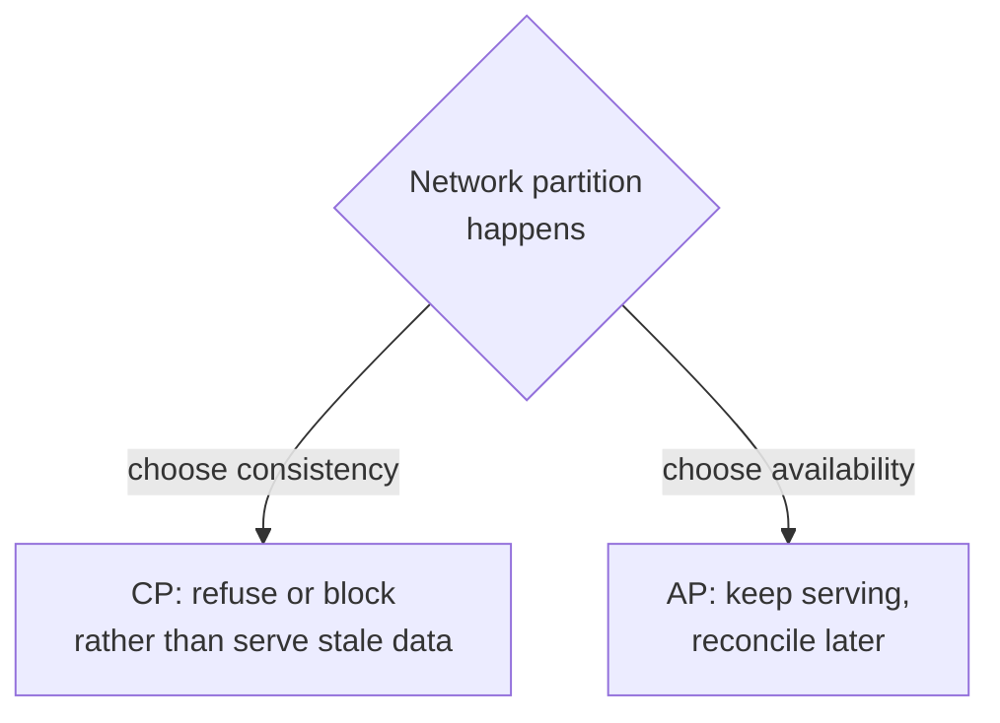

# Availability vs consistency

> When the network splits, a distributed system must choose: keep answering with possibly-stale data (availability), or refuse to answer rather than be wrong (consistency). That choice is the CAP theorem.

## The CAP theorem

A distributed system juggles three properties:

- **Consistency (C)**: every read sees the most recent write (or an error). All nodes agree.
- **Availability (A)**: every request gets a non-error response — though not necessarily the latest data.
- **Partition tolerance (P)**: the system keeps working even when the network drops or delays messages between nodes.

CAP says: **during a network partition, you can have C or A, but not both.** Partitions are a fact of life in any real network, so P is not optional — which means the real choice is between **CP** and **AP** *when a partition happens*.

| Choice | Behavior during a partition | Good for | Examples |
|--------|-----------------------------|----------|----------|
| **CP** (consistency + partition tolerance) | Reject requests that can't be made consistent | Money, inventory, anything where a wrong answer is worse than no answer | Spanner, ZooKeeper, HBase |
| **AP** (availability + partition tolerance) | Keep answering with possibly-stale data, converge later | Feeds, catalogs, likes, presence — where a brief staleness is fine | Dynamo, Cassandra, DynamoDB |

There is no "CA" system in the real world: you cannot drop partition tolerance on a network that can partition.

## When there is no partition: PACELC

CAP only describes the partition case. Most of the time the network is healthy — and even then you face a trade-off, which **PACELC** captures:

> **If Partition, then Availability or Consistency; Else, Latency or Consistency.**

In other words, even with no partition, keeping replicas strongly consistent costs latency (you must coordinate before answering). Systems that relax consistency for lower latency (Dynamo-style: "PA/EL") feel fast but can serve stale reads; systems that hold the line on consistency (Spanner: "PC/EC") pay a coordination cost on every write.

## How to choose

Ask what a **stale or wrong answer** costs for *this* data:

- Showing a like count that is off by 3 for a few seconds → harmless → lean **AP**.
- Letting two people book the same seat, or double-spending a balance → unacceptable → lean **CP**.

The choice is per-dataset, not per-system. A single product often uses CP for payments and AP for the activity feed. Say that out loud in an interview.

## Go deeper

- Read more (free): [CAP Theorem vs PACELC](https://www.designgurus.io/blog/system-design-interview-basics-cap-vs-pacelc)
- Related pattern: [CAP theorem](../patterns/cap-theorem.md), [consistency models](../patterns/consistency-models.md)
- Full course: [Grokking the System Design Interview](https://www.designgurus.io/course/grokking-the-system-design-interview)
