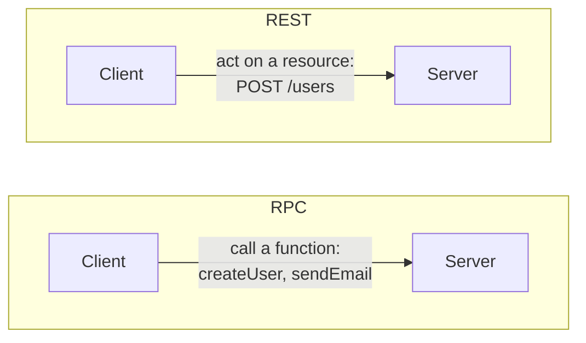

# Communication

> How services talk to each other and to clients: the transport protocols (TCP, UDP) underneath, the request protocol (HTTP) on top, and the two dominant API styles (RPC and REST). Choosing well per boundary is a senior-level signal.

## The transport layer: TCP vs UDP

Every network call rides on one of two transport protocols:

| | TCP | UDP |
|--|-----|-----|
| Connection | Connection-oriented (handshake first) | Connectionless (just send) |
| Reliability | Guaranteed, ordered, retransmitted | Best-effort; packets can drop or arrive out of order |
| Overhead | Higher (acks, ordering, flow control) | Minimal |
| Use for | Anything that must be correct: web, APIs, databases, file transfer | Anything where fresh-but-lossy beats reliable-but-late: live video/voice, gaming, DNS lookups |

The rule of thumb: **TCP when you can't lose data, UDP when you can't afford to wait.** A dropped frame in a video call is fine (you move on); a dropped byte in a bank transfer is not.

## HTTP: the request/response protocol of the web

HTTP is a request/response protocol built on TCP. A client sends a method + URL + headers (+ body); the server returns a status code + headers + body. The **verb** signals intent, and the properties of each verb matter for retries and caching:

| Method | Meaning | Safe? | Idempotent? | Cacheable? |
|--------|---------|-------|-------------|-----------|
| GET | Read a resource | Yes | Yes | Yes |
| POST | Create / trigger an action | No | No | Rarely |
| PUT | Replace a resource | No | Yes | No |
| PATCH | Partially update | No | No | No |
| DELETE | Remove a resource | No | Yes | No |

- **Safe** = doesn't change server state (so it's freely retriable and cacheable).
- **Idempotent** = doing it twice has the same effect as doing it once — critical for safe retries. See [idempotency](../patterns/idempotency.md). Note POST is not idempotent, which is why "double-charged" bugs come from retried POSTs; add an idempotency key.

HTTP/2 and HTTP/3 add multiplexing and (in HTTP/3) a UDP-based transport (QUIC) for lower latency, but the request/response semantics above are unchanged.

## API styles: RPC vs REST

Two philosophies for designing the API between services:

- **RPC (remote procedure call)**: the client calls what looks like a local function — `createUser(name)`, `charge(cardId, amount)`. The API is a list of **actions**. Fast and natural for internal service-to-service calls; gRPC (RPC over HTTP/2 with Protocol Buffers) is the common modern choice. Downside: tighter coupling and less uniformity.
- **REST (representational state transfer)**: the API is a set of **resources** (`/users`, `/orders/42`) manipulated with standard HTTP verbs. Uniform, cacheable, easy to consume from anywhere, evolves well — the default for public and cross-team APIs. Downside: chatty for complex operations, and not every action maps cleanly to a resource.

| | RPC | REST |
|--|-----|------|
| Models | Actions / functions | Resources |
| Coupling | Tighter | Looser |
| Best for | Internal, high-performance service-to-service | Public / cross-team APIs |
| Common tech | gRPC, Thrift | HTTP + JSON |

GraphQL is a third option that lets clients ask for exactly the fields they need in one round trip — great for aggregating data for varied frontends. The per-boundary comparison is in the [REST vs gRPC vs GraphQL](../cheat-sheets/rest-vs-grpc-vs-graphql.md) cheat sheet.

## Real-time: when request/response isn't enough

For server-initiated updates (chat, live scores, presence), plain request/response doesn't fit. Reach for long polling, Server-Sent Events, or WebSockets — compared in [long polling vs WebSockets vs SSE](../patterns/long-polling-websockets-sse.md).

## Go deeper

- Related: [REST vs gRPC vs GraphQL](../cheat-sheets/rest-vs-grpc-vs-graphql.md), [long polling vs WebSockets vs SSE](../patterns/long-polling-websockets-sse.md), [idempotency](../patterns/idempotency.md)
- Read more (free): [REST vs GraphQL vs gRPC](https://www.designgurus.io/blog/rest-graphql-grpc-system-design)
- Full course: [Grokking the System Design Interview](https://www.designgurus.io/course/grokking-the-system-design-interview)
