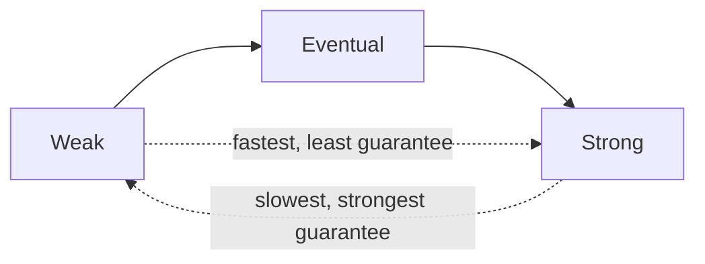

# Consistency patterns

> With copies of data on multiple nodes, "consistency" means how soon and how reliably every reader sees the latest write. There is a spectrum from weak to strong, and each point trades latency and availability for correctness.

## The spectrum

### Weak consistency

After a write, reads **may or may not** see it, and there is no promise about when they will. The system does its best and moves on. This is right when a missed update simply doesn't matter and latency is everything.

- Examples: live video, voice/VoIP, multiplayer game state. If you drop a packet mid-call, you don't rewind — you carry on with the next one.

### Eventual consistency

After a write, reads may be stale for a while, but **if writes stop, all replicas converge** to the same value. Staleness is bounded in practice (often milliseconds to seconds) and the system stays highly available.

- Examples: DNS propagation, email, social feeds, like counts, most [AP systems](availability-vs-consistency.md) like [Cassandra](../deep-dives/cassandra-wide-column-db.md) and [DynamoDB](../deep-dives/dynamodb-managed-nosql.md).
- This is the default for large, read-heavy, availability-first systems. The art is making the staleness window small and invisible to users.

### Strong consistency

After a write completes, **every subsequent read sees it** — reads and writes appear to happen in a single, global order. This requires coordination (a leader, a [quorum](../patterns/quorum.md), or a consensus protocol), which costs latency and can reduce availability during partitions.

- Examples: relational databases, [Spanner](../deep-dives/spanner-global-sql.md), coordination services like [ZooKeeper](../deep-dives/zookeeper-coordination.md), anything financial.

## Useful middle grounds

Real systems often want something between eventual and strong for a *single client's* experience:

| Model | Guarantee | Typical use |
|-------|-----------|-------------|
| **Read-your-writes** | You always see your own updates | Post a comment and see it immediately, even if others don't yet |
| **Monotonic reads** | You never see time go backwards | A refreshed feed never loses items it just showed you |
| **Causal consistency** | Cause is seen before effect | A reply never appears before the message it answers |

These "session guarantees" are often enough to make an eventually-consistent system *feel* correct to each user, without paying full strong-consistency cost.

## How to choose

Match the model to the cost of staleness (see [availability vs consistency](availability-vs-consistency.md)):

- Feeds, counts, catalogs, presence → **eventual** (fast, available).
- Money, inventory, unique bookings, config that gates behavior → **strong** (coordinate before answering).
- Ephemeral real-time media → **weak** (drop and move on).

Tunable stores like Cassandra and DynamoDB let you pick per operation via [quorum](../patterns/quorum.md) settings — strong for the checkout write, eventual for the product-page read.

## Go deeper

- Read more (free): [Consistency Patterns in Distributed Systems](https://www.designgurus.io/blog/consistency-patterns-distributed-systems)
- Related pattern: [Consistency models](../patterns/consistency-models.md), [quorum](../patterns/quorum.md)
- Full course: [Grokking the System Design Interview](https://www.designgurus.io/course/grokking-the-system-design-interview)
