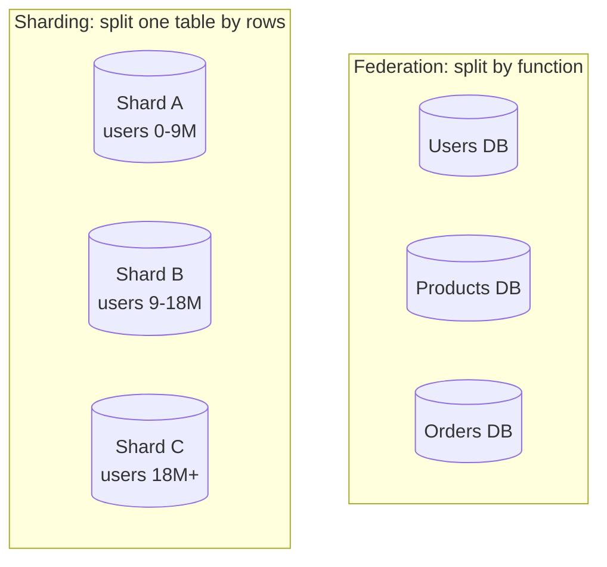

# Databases

> The data tier is where most system designs live or die. This page covers how relational databases scale (replication, federation, sharding, denormalization, tuning) and the four NoSQL families — so you can justify a storage choice instead of naming one.

## Relational (RDBMS)

A relational database stores data in tables with a schema, enforces constraints, and gives you **ACID** transactions and SQL joins. It's the right default when your data is relational and you need strong guarantees. The challenge is scaling writes and very large datasets. The toolbox:

### Replication

Keep copies on multiple nodes for availability and read scaling — see the [replication pattern](../patterns/replication.md) and [availability patterns](availability-patterns.md).

- **Leader–follower (master–slave)**: one node takes writes and streams them to read-only followers. Scales reads; the leader is the write bottleneck and a failure point (handle with [leader election](../patterns/leader-election.md)).
- **Multi-leader (master–master)**: several nodes accept writes and sync to each other. Scales writes and survives a node loss, but you must resolve **write conflicts** and tolerate replication lag.

### Federation

Split databases **by function** — one for users, one for products, one for orders. Each is smaller, gets its own cache and read replicas, and can scale independently. The cost: cross-function joins now happen in the application, and transactions can't span databases.

### Sharding (horizontal partitioning)

Split one logical table **by rows** across many nodes, each holding a slice keyed by a shard key (user ID, geography, hash). This is how you scale beyond one machine's write and storage limits. Pick the shard key carefully to avoid hot spots, and use [consistent hashing](../patterns/consistent-hashing.md) to minimize reshuffling when nodes change. Full detail: [sharding and partitioning](../patterns/sharding-partitioning.md).

### Denormalization

Deliberately duplicate data (precompute joins, store redundant columns) so reads hit one place instead of joining across shards. It trades write complexity and storage for read speed — the right move for read-heavy paths once joins become the bottleneck.

### SQL tuning

Before scaling out, make one node fast: add the right [indexes](../patterns/database-indexing.md), rewrite slow queries, avoid `SELECT *` on hot paths, use connection pooling, and cache expensive results ([caching](../patterns/caching.md)). Measure with the query planner first — most "we need NoSQL" problems are a missing index.

## NoSQL

NoSQL trades some of the relational model (joins, multi-row ACID) for horizontal scale, flexible schemas, and availability. Four families:

| Family | Model | Strengths | Examples | Good for |
|--------|-------|-----------|----------|----------|
| **Key-value** | Key → opaque value | Fastest, simplest, easy to shard | Redis, [DynamoDB](../deep-dives/dynamodb-managed-nosql.md), [Dynamo](../deep-dives/dynamo-key-value-store.md) | Caches, sessions, simple lookups |
| **Document** | Key → JSON-like document | Flexible schema, query inside docs | MongoDB, Couchbase | Catalogs, user profiles, content |
| **Wide-column** | Rows with dynamic column families | Huge write throughput, sparse data | [Cassandra](../deep-dives/cassandra-wide-column-db.md), [BigTable](../deep-dives/bigtable-wide-column-store.md), HBase | Time series, feeds, event logs |
| **Graph** | Nodes + edges | Fast relationship traversal | Neo4j, Neptune | Social graphs, recommendations, fraud |

Most NoSQL stores favor [availability and eventual consistency](consistency-patterns.md) (AP), though many now offer tunable consistency via [quorum](../patterns/quorum.md) settings.

## SQL or NoSQL?

There's no universal winner — match the store to the workload:

- **Lean SQL** when you need strong transactions, complex ad-hoc queries and joins, or your data is naturally relational and fits comfortably on scalable hardware.
- **Lean NoSQL** when you need massive scale or write throughput, a flexible/evolving schema, or your access pattern is simple key lookups and can tolerate eventual consistency.

Real systems use **both** (polyglot persistence): Postgres for orders and payments, Redis for sessions, Cassandra for the activity feed, Elasticsearch for search. The concrete version of this decision is in the [SQL vs NoSQL](../cheat-sheets/sql-vs-nosql.md) and [Postgres vs DynamoDB vs Cassandra](../cheat-sheets/postgres-vs-dynamodb-vs-cassandra.md) cheat sheets.

## Go deeper

- Read more (free): [Database Sharding Guide](https://www.designgurus.io/blog/database-sharding-guide-2026), [Database Indexing Explained](https://www.designgurus.io/blog/database-indexing)
- Related: [SQL vs NoSQL](../cheat-sheets/sql-vs-nosql.md), [sharding and partitioning](../patterns/sharding-partitioning.md), [database indexing](../patterns/database-indexing.md)
- Full course: [Grokking the System Design Interview](https://www.designgurus.io/course/grokking-the-system-design-interview)
