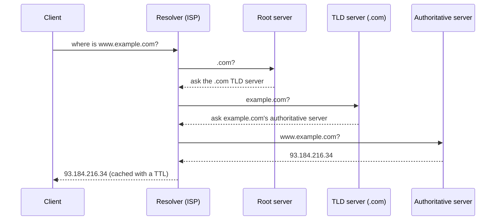

# Domain Name System (DNS)

> DNS is the internet's phone book: it turns a human name like `www.example.com` into the IP address a client actually connects to. It is also a quietly powerful tool for load distribution and failover.

## Why it exists

Humans remember names; machines route to IP addresses. DNS is the distributed, hierarchical system that resolves one into the other. It is one of the earliest steps in *every* request your system serves, so its latency and availability matter.

## How a lookup works

The resolver caches the answer for the record's **TTL** (time to live), so most lookups never travel this whole path. Short TTLs make changes propagate fast but increase lookup load; long TTLs are cheaper but slow to update.

## Record types worth knowing

| Record | Maps | Example use |
|--------|------|-------------|
| **A / AAAA** | Name → IPv4 / IPv6 address | The basic "where is this host" |
| **CNAME** | Name → another name | `www` → `example.com`, or app → a load balancer's hostname |
| **NS** | Domain → authoritative name servers | Delegation |
| **MX** | Domain → mail servers | Email routing |
| **TXT** | Name → arbitrary text | Domain verification, SPF/DKIM |

## DNS as a traffic tool

DNS is not just resolution — it is a first, cheap layer of routing and resilience:

- **Round-robin**: return multiple A records so clients spread across servers (crude load balancing; no health awareness).
- **Geo / latency-based routing**: return the IP of the nearest or fastest region, cutting round-trip time.
- **Failover**: health-checked DNS can stop returning a dead endpoint's IP (bounded by the TTL — this is why failover DNS uses short TTLs).
- **Weighted routing**: send a percentage of traffic to a new version (canary) by weighting records.

Managed services (Route 53, Cloudflare, NS1) build all of this on top of DNS.

## Costs and caveats

- **Latency**: an uncached lookup adds a round trip before the real request even starts. Caching and keeping TTLs sensible matter.
- **Propagation delay**: changes are not instant — they roll out as caches expire.
- **A dependency and a target**: DNS is a single point of failure if you use one provider, and a classic DDoS target. Large sites use multiple providers.

## Go deeper

- Related pattern: [CDN](../patterns/cdn.md) (DNS steers users to the nearest edge), [load balancing](../patterns/load-balancing.md)
- Read more (free): [System Design Interview Fundamentals](https://www.designgurus.io/blog/system-design-interview-fundamentals)
- Full course: [Grokking the System Design Interview](https://www.designgurus.io/course/grokking-the-system-design-interview)
