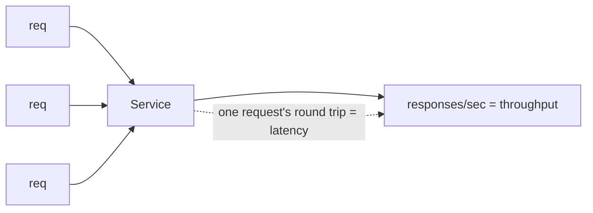

# Latency vs throughput

> Latency is how long one request takes. Throughput is how many requests you handle per unit of time. You usually want low latency and high throughput, and sometimes you must trade one for the other.

## What they are

- **Latency**: the time to serve a single request, end to end. Measured in milliseconds, and best described by percentiles, not averages.
- **Throughput**: the amount of work done per unit of time — requests per second (RPS/QPS), messages per second, or bytes per second.

A highway analogy: **latency** is how long your car takes to drive from one city to the next. **Throughput** is how many cars per hour the highway moves. A wider highway (more lanes) raises throughput without making any single trip faster.

## Measure latency with percentiles, not averages

Averages hide the pain. If 99 requests take 10 ms and one takes 2 seconds, the average is ~30 ms — which no user actually experienced. Report **percentiles**:

| Percentile | Reads as | Why it matters |
|-----------|----------|----------------|
| p50 (median) | Half of requests are faster than this | The typical experience |
| p95 | 95% are faster | Where slowness starts to show |
| p99 | 99% are faster | The "tail"; often what users complain about |
| p99.9 | 999 of 1000 are faster | Critical at scale — 1 in 1,000 is a lot of requests |

At scale the **tail latency** dominates user experience: a page that makes 100 backend calls will, on average, hit a p99-slow call on most page loads. This is why big systems obsess over p99 and p99.9.

## The relationship

Latency and throughput are related but not the same. You can improve throughput (add servers, batch work) without improving the latency of any single request. You can improve latency (a [cache](../patterns/caching.md), a faster query) and often raise throughput as a side effect because each request holds resources for less time.

**Little's Law** ties them together: the average number of concurrent requests in the system equals throughput × latency. Halve latency and you can carry the same concurrency at double the throughput — or the same throughput with half the resources.

## The numbers worth knowing

Order-of-magnitude latencies drive most design decisions:

| Operation | Rough time |
|-----------|-----------|
| Memory reference | ~100 ns |
| SSD random read | ~100 µs |
| Round trip in one data center | ~500 µs |
| Disk seek (spinning) | ~10 ms |
| Round trip between continents | ~150 ms |

Memory is ~100× faster than SSD, which is far faster than a disk seek, which is far faster than a cross-continent hop. Design so the common path stays in the fast tiers. The full table lives in the [estimation cheat sheet](../cheat-sheets/estimation.md).

## In an interview

State your latency target as a percentile ("p99 under 200 ms") and your throughput target as QPS. Then justify each component against those numbers. Vague goals ("it should be fast") read as junior.

## Go deeper

- Read more (free): [Back-of-the-Envelope Estimation](https://www.designgurus.io/blog/back-of-the-envelope-system-design-interview)
- Related: [Estimation cheat sheet](../cheat-sheets/estimation.md), [caching](../patterns/caching.md)
- Full course: [Grokking the System Design Interview](https://www.designgurus.io/course/grokking-the-system-design-interview)
