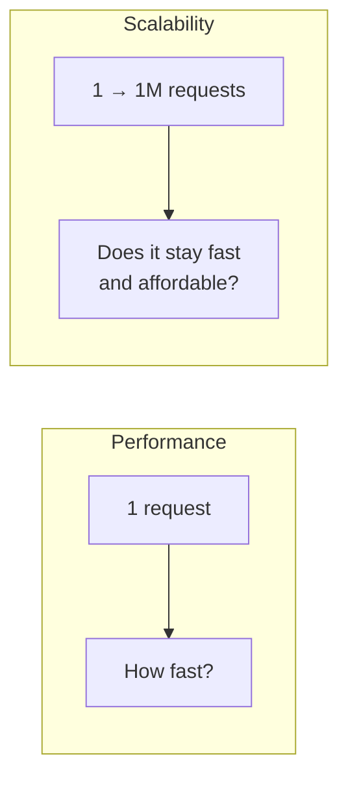

# Performance vs scalability

> Performance is how fast the system is for one user. Scalability is whether it stays that way as users, data, or traffic grow.

## What they are

These two words get used interchangeably, but they describe different problems.

- **Performance**: how quickly the system does one unit of work right now. A slow page is a performance problem — it is slow even with one user.
- **Scalability**: how the system's performance and cost behave as load increases. A system scales well if adding load only requires adding proportional resources, and performance per request stays roughly flat.

A useful test: if your system is slow for a single user, you have a **performance** problem. If it is fast for one user but falls over under many, you have a **scalability** problem.

## Scaling up vs scaling out

There are two ways to add capacity:

| Approach | What it means | Trade-off |
|----------|---------------|-----------|
| **Vertical (scale up)** | A bigger machine: more CPU, RAM, faster disks | Simple, no code changes; but there is a ceiling, it gets expensive fast, and it is a single point of failure |
| **Horizontal (scale out)** | More machines behind a [load balancer](../patterns/load-balancing.md) | No hard ceiling, fault tolerant; but requires stateless services, data partitioning, and more operational complexity |

Most large systems scale out. The hard part of scaling out is **state**: as soon as you have more than one server, you must decide where user sessions, caches, and data live. Keeping application servers **stateless** (pushing state into a shared store or the client) is what makes horizontal scaling possible. See [sharding and partitioning](../patterns/sharding-partitioning.md) for scaling the data tier.

## A scalable system, defined

A system scales if, as demand grows, you can preserve performance by adding resources in proportion to the load — not exponentially. Watch for these anti-signs of poor scalability:

- Latency climbs as the dataset grows (an unindexed query, an O(n) scan). See [database indexing](../patterns/database-indexing.md).
- One component (a single database, a lock, a leader) becomes a bottleneck every request must pass through.
- Cost per request rises with scale instead of staying flat or falling.

## In an interview

Say which problem you are solving. "This is read-heavy, so my scaling concern is read throughput — I will add [replicas](../patterns/replication.md) and a [cache](../patterns/caching.md)" shows you know the difference. Naming the bottleneck *before* you add boxes is the senior move.

## Go deeper

- Read more (free): [Scalability in System Design](https://www.designgurus.io/blog/grokking-system-design-scalability)
- Related pattern: [Load balancing](../patterns/load-balancing.md), [sharding and partitioning](../patterns/sharding-partitioning.md)
- Full course: [Grokking the System Design Interview](https://www.designgurus.io/course/grokking-the-system-design-interview)
