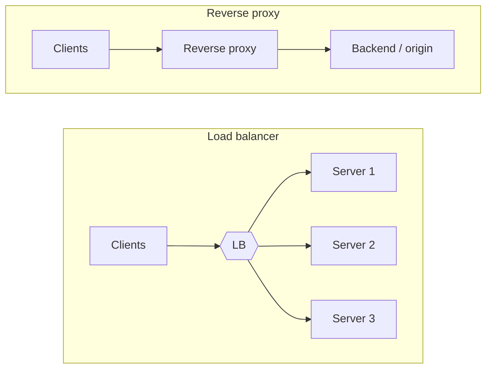

# Reverse proxy vs load balancer

> Both sit in front of your servers and forward requests, so they look alike on a diagram. The difference is intent: a load balancer spreads traffic across *many identical* backends; a reverse proxy is a smart front door for *your* services, even if there's only one.

## The two boxes

- A **load balancer** distributes incoming requests across a pool of interchangeable servers to spread load and route around failures.
- A **reverse proxy** is a server that accepts client requests and forwards them to one or more backends on the client's behalf, adding cross-cutting features (TLS, caching, compression, auth) at the edge.

In practice one piece of software (NGINX, Envoy, HAProxy, a cloud ALB) often does **both** at once — which is exactly why the terms blur.

## Load balancing: how traffic is spread

Load balancers operate at one of two layers:

| Layer | Decides based on | Can it read the request? | Use it for |
|-------|------------------|--------------------------|------------|
| **Layer 4 (transport)** | IP address and TCP/UDP port | No (it forwards packets) | Raw speed, any protocol, very high throughput |
| **Layer 7 (application)** | URL path, headers, cookies | Yes (terminates the connection) | Content-based routing, sticky sessions, TLS termination, per-path rules |

Common algorithms: round-robin, least-connections, least-response-time, IP-hash (sticky). Health checks let the balancer stop sending traffic to a dead backend. See the [load balancing pattern](../patterns/load-balancing.md) for the full treatment.

## Reverse proxy: what the front door adds

Even with a single backend, a reverse proxy earns its place by centralizing concerns:

- **TLS termination** — decrypt HTTPS once at the edge, speak plain HTTP internally.
- **Caching** — serve cached responses without touching the backend (see [caching](../patterns/caching.md), [CDN](../patterns/cdn.md)).
- **Compression** and request/response rewriting.
- **Security** — hide backend topology, filter bad requests, enforce [rate limits](../patterns/rate-limiting.md).
- **Routing** — send `/api` to one service and `/static` to another.

When a reverse proxy also authenticates, rate-limits, and routes for many services, you call it an [API gateway](../patterns/api-gateway.md).

## So which do you need?

| You want to… | Reach for |
|--------------|-----------|
| Spread load across many identical servers, survive a node failure | **Load balancer** |
| Terminate TLS, cache, and hide a backend behind one entry point | **Reverse proxy** |
| Do both — one entry point, many backends, cross-cutting policy | Software that combines them (NGINX/Envoy) or an [API gateway](../patterns/api-gateway.md) |

The honest interview answer is usually "the same box does both": clients hit one address, TLS terminates there, and requests fan out to a healthy pool.

## Go deeper

- Related pattern: [Load balancing](../patterns/load-balancing.md), [proxies](../patterns/proxies.md), [API gateway](../patterns/api-gateway.md)
- Related fundamental: [Application layer](application-layer.md)
- Full course: [Grokking the System Design Interview](https://www.designgurus.io/course/grokking-the-system-design-interview)
