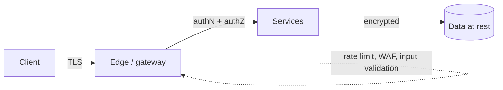

# Security

> You won't design a full security architecture in a system design interview, but a senior candidate mentions the baseline unprompted: encrypt everything in transit and at rest, authenticate and authorize every request, validate all input, and grant least privilege.

## The baseline to name

### Encrypt in transit

Use **TLS/HTTPS** for every connection — client-to-edge and service-to-service. Terminate TLS at the [reverse proxy / gateway](reverse-proxy-vs-load-balancer.md) and, for sensitive internal traffic, use mutual TLS (mTLS) between services. Never send credentials or tokens over plain HTTP.

### Encrypt at rest

Encrypt databases, object storage, and backups. Manage keys in a dedicated key management service (KMS), rotate them, and keep secrets out of source code and environment dumps (use a secrets manager).

### Authentication vs authorization

- **Authentication (authN)**: *who are you?* Verify identity — passwords + MFA, OAuth/OIDC, API keys, signed tokens (JWT).
- **Authorization (authZ)**: *what are you allowed to do?* Check permissions on every request — role-based (RBAC) or attribute-based (ABAC) access control. Authenticate once, but authorize on **every** call; don't trust that an earlier check still holds.

### Validate and sanitize all input

Treat every input as hostile. Validate types, lengths, and ranges; use parameterized queries to prevent SQL injection; encode output to prevent XSS; validate file uploads. The [API gateway](../patterns/api-gateway.md) is a good place to enforce a first layer.

### Least privilege

Every user, service, and token gets the **minimum** access it needs, nothing more. Scope database credentials to the tables a service uses; scope tokens to the actions they need; segment the network so a compromised service can't reach everything.

## Protecting availability

Security includes staying up under attack:

- **Rate limiting and throttling** at the edge to blunt abuse and credential-stuffing — see [rate limiting](../patterns/rate-limiting.md).
- **DDoS protection** via a [CDN](../patterns/cdn.md) / scrubbing layer and autoscaling.
- **WAF** (web application firewall) to filter known-bad request patterns.
- **Idempotency keys** so retried/replayed requests don't double-charge — see [idempotency](../patterns/idempotency.md).

## Defense in depth

No single control is enough; layer them so one failure isn't catastrophic: TLS + authN + authZ + input validation + least privilege + monitoring. Log security-relevant events and alert on anomalies — detection matters as much as prevention.

## In an interview

A single sentence signals maturity: "All traffic is over TLS, data is encrypted at rest, every request is authenticated and authorized, input is validated at the gateway, and services run with least-privilege credentials." Then go deeper only if asked.

## Go deeper

- Related pattern: [API gateway](../patterns/api-gateway.md), [rate limiting](../patterns/rate-limiting.md)
- Related fundamental: [Reverse proxy vs load balancer](reverse-proxy-vs-load-balancer.md)
- Full course: [Grokking the System Design Interview](https://www.designgurus.io/course/grokking-the-system-design-interview)
