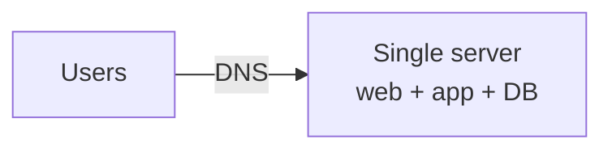
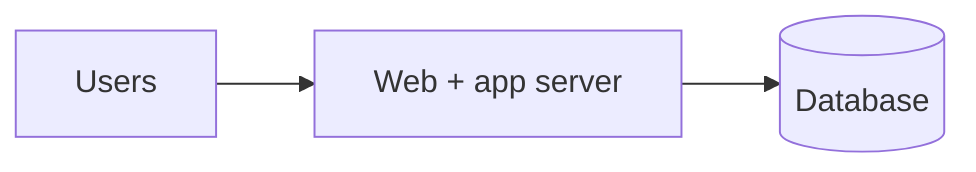
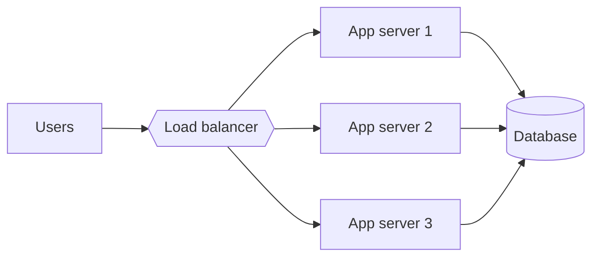
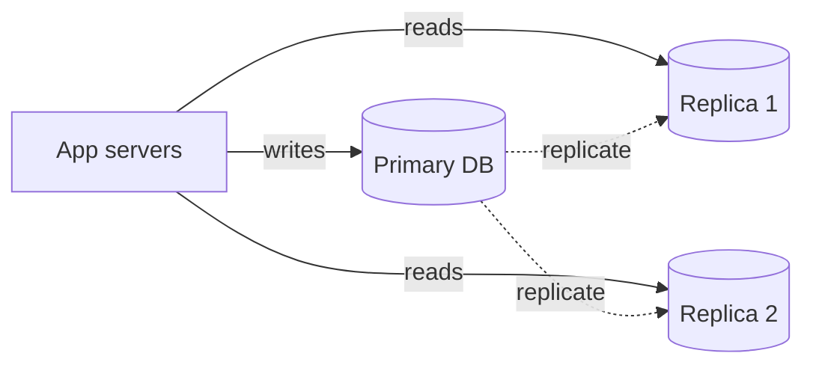
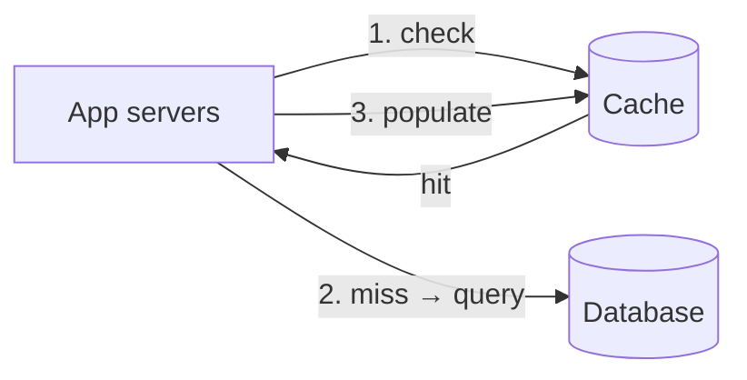
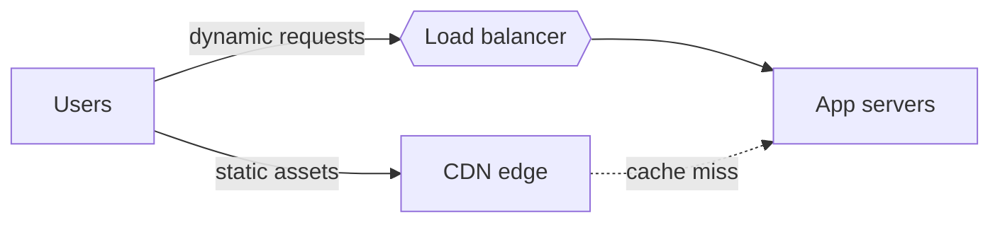
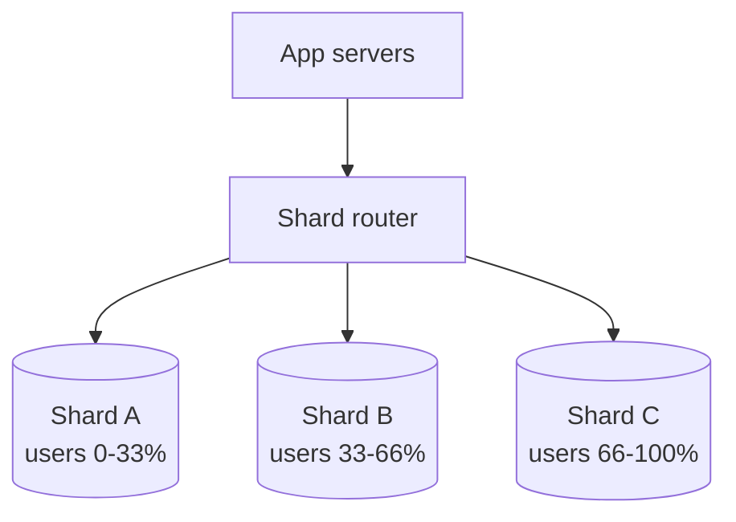
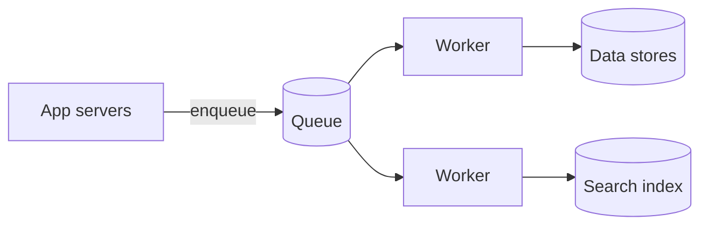
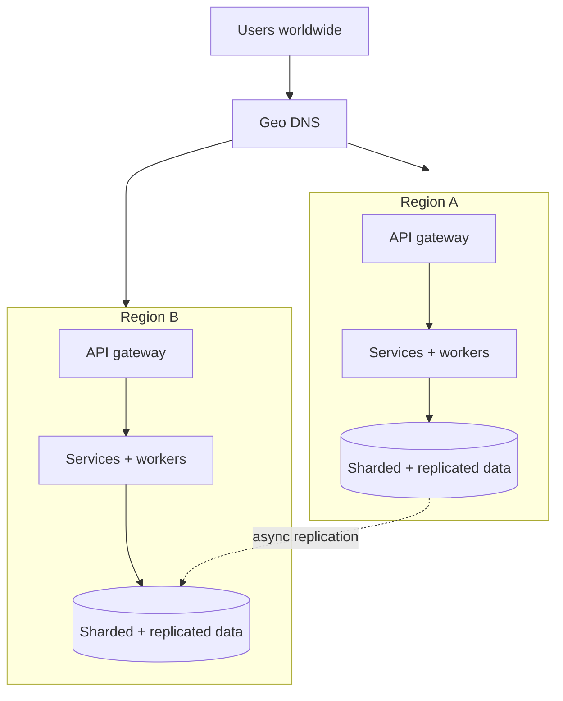

# Scaling from one user to millions

> One story, told in stages: how a single-box app grows into a system that serves millions of users. Each step is triggered by a specific bottleneck, and each fix is one of the [patterns](../patterns/). Follow the evolution and the whole map of system design falls into place.

The point of this walkthrough is not the final architecture — it's the *sequence of decisions*. In an interview, you rarely jump to the end state; you start simple and evolve it as the interviewer adds load. This is that evolution.

---

## Stage 0: one server

Everything runs on a single machine — web server, application code, and database — behind a domain name resolved by [DNS](../fundamentals/dns.md).

- **Good enough for**: an MVP, early users, validating the idea.
- **Breaks when**: traffic outgrows one machine's CPU/RAM, or a single crash takes down everything (no redundancy).

---

## Stage 1: split the database off the app

The first split: move the database to its own machine so the web/app tier and the data tier can scale — and fail — independently.

- **Why**: the app is CPU-bound, the database is memory/disk-bound. Separating them lets you size each correctly and keeps a slow query from starving request handling.
- **Next bottleneck**: one app server is still a single point of failure, and it caps how many concurrent requests you can serve. Related: [performance vs scalability](../fundamentals/performance-vs-scalability.md).

---

## Stage 2: add a load balancer and clone the app tier

Run several identical app servers behind a [load balancer](../patterns/load-balancing.md). The balancer spreads requests and routes around any instance that dies. This is **horizontal scaling**.

- **The catch — state**: if a user's session lives in one server's memory, the load balancer must pin them there (sticky sessions) or the next request lands on a server that's never heard of them. The fix is to make app servers **stateless**: push session data into a shared store (Redis) or a signed token in the client. Now any server can handle any request. See [performance vs scalability](../fundamentals/performance-vs-scalability.md) and [reverse proxy vs load balancer](../fundamentals/reverse-proxy-vs-load-balancer.md).
- **Next bottleneck**: every app server hammers one database. Reads dominate, and the database is now the ceiling.

---

## Stage 3: scale reads with database replicas

Add read [replicas](../patterns/replication.md): one primary takes writes and streams them to followers that serve reads. Most apps are read-heavy, so this buys a lot of headroom.

- **Why**: separates the read and write paths so reads scale by adding replicas.
- **Trade-off**: **replication lag** means a read replica may briefly return stale data — you've entered [eventual consistency](../fundamentals/consistency-patterns.md) for reads. Use read-your-writes tricks (read from the primary right after a write) where it matters.
- **Next bottleneck**: replicas help reads but the same hot rows get read over and over, and each read still costs a database round trip.

---

## Stage 4: add a cache

Put a [cache](../patterns/caching.md) (Redis/Memcached) in front of the database. Serve hot reads from memory in microseconds instead of hitting disk. The common approach is **cache-aside**: on a miss, read the DB and populate the cache.

- **Impact**: a good cache absorbs the large majority of reads, so the database load drops sharply and read latency falls to memory speed. Recall memory is ~100× faster than SSD (see [latency vs throughput](../fundamentals/latency-vs-throughput.md)).
- **The hard parts**: invalidation (keep it fresh with TTLs / write-through) and the **thundering herd** when a hot key expires. See [caching](../patterns/caching.md).
- **Next bottleneck**: users far from your data center still wait on the network, and static assets (images, video, JS) clog your servers.

---

## Stage 5: push static content to a CDN

Serve images, video, CSS, and JS from a [CDN](../patterns/cdn.md) — edge servers close to users. [DNS](../fundamentals/dns.md) steers each user to the nearest edge.

- **Why**: cuts latency (content travels a shorter distance), offloads bandwidth from your origin, and improves availability under load.
- **Next bottleneck**: writes now dominate the pain — a single primary database can't absorb the write volume or store all the data.

---

## Stage 6: shard the database (and denormalize)

Split the data across many database nodes by a **shard key** so writes and storage scale beyond one machine. Use [consistent hashing](../patterns/consistent-hashing.md) so adding a shard reshuffles minimal data, and [denormalize](../fundamentals/databases.md) hot read paths so you don't need cross-shard joins.

- **Why**: no single node holds all the data or takes all the writes.
- **Trade-offs**: cross-shard queries and transactions get hard, and a bad shard key creates **hot spots**. This is where you may also introduce NoSQL stores for specific access patterns — see [databases](../fundamentals/databases.md) and [sharding and partitioning](../patterns/sharding-partitioning.md).
- **Next bottleneck**: some work (encoding, notifications, analytics) is too slow or spiky to do inside a request.

---

## Stage 7: move slow work off the request path

Introduce [message queues](../patterns/message-queues.md) and background workers. The API accepts a request, enqueues a job, and returns immediately; workers process asynchronously. See [asynchronism](../fundamentals/asynchronism.md).

- **Why**: keeps the user-facing path fast, absorbs spikes (the queue buffers bursts), and lets you scale workers independently.
- **Watch**: apply [back pressure](../fundamentals/asynchronism.md) so producers can't overrun consumers, and make workers [idempotent](../patterns/idempotency.md) since queues deliver at-least-once.

---

## Stage 8: split into services, autoscale, go multi-region

At the top end, split the monolith into [services](../fundamentals/application-layer.md) owned by different teams, front them with an [API gateway](../patterns/api-gateway.md), protect them with [circuit breakers](../patterns/circuit-breaker.md), autoscale each tier on demand, and replicate across regions for latency and disaster recovery.

- **Why**: independent scaling and deploys per service ([application layer](../fundamentals/application-layer.md)), and regional redundancy for [availability](../fundamentals/availability-patterns.md) and low global latency.
- **The hardest trade-off**: cross-region data means confronting [CAP and PACELC](../fundamentals/availability-vs-consistency.md) head-on — do you replicate synchronously (consistent, slower writes) or asynchronously (fast, eventually consistent)? The answer is per-dataset.

---

## The through-line

Notice the pattern behind the pattern: **each stage is triggered by a specific, named bottleneck, and each fix trades something away.** Replicas trade consistency for read scale; caches trade freshness for latency; sharding trades query flexibility for write scale; async trades immediacy for smoothness. Naming the bottleneck *before* reaching for the fix — and stating the trade-off you're accepting — is exactly what an interviewer is listening for.

| Stage | Bottleneck | Fix | Pattern |
|-------|-----------|-----|---------|
| 1 | App and DB contend | Separate the tiers | — |
| 2 | One app server | Load balancer + stateless clones | [Load balancing](../patterns/load-balancing.md) |
| 3 | Read load on DB | Read replicas | [Replication](../patterns/replication.md) |
| 4 | Repeated hot reads | Cache | [Caching](../patterns/caching.md) |
| 5 | Distant users, static load | CDN | [CDN](../patterns/cdn.md) |
| 6 | Write/storage ceiling | Shard + denormalize | [Sharding](../patterns/sharding-partitioning.md) |
| 7 | Slow/spiky work | Queues + workers | [Message queues](../patterns/message-queues.md) |
| 8 | Team scale, global latency | Services + multi-region | [API gateway](../patterns/api-gateway.md) |

## Go deeper

- Practice this end to end on real problems in the [question catalog](../questions/).
- Read more (free): [System Design Interview Guide (2026)](https://www.designgurus.io/blog/complete-guide-sys-design)
- Full course: [Grokking the System Design Interview](https://www.designgurus.io/course/grokking-the-system-design-interview)
