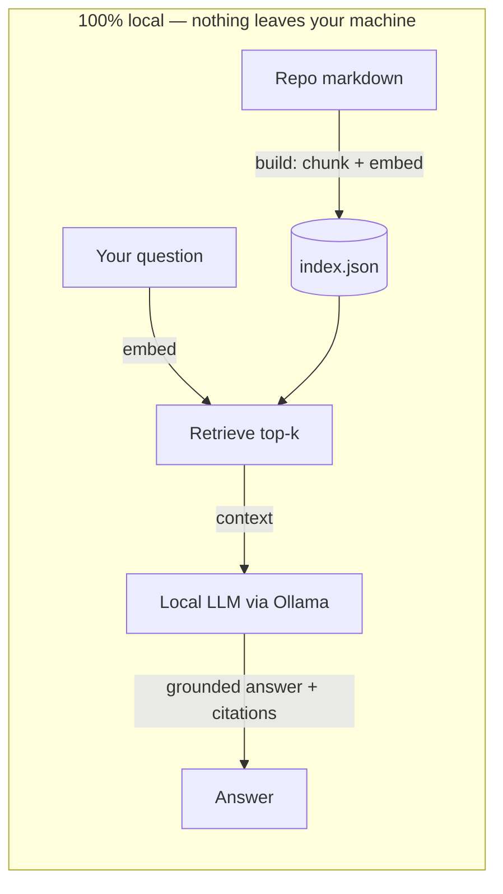

# Study assistant — a local, offline AI tutor for this repo

> Ask questions about system design and get answers grounded in *this* repository, with citations — running entirely on your own machine. No API keys, no data leaves your laptop.

This is a small [retrieval-augmented generation](../../questions/design-rag-pipeline.md) (RAG) tool. It indexes every markdown page in the repo, finds the sections most relevant to your question, and asks a **local** LLM (via [Ollama](https://ollama.com)) to answer using only those sections — citing the source files so you can read the full page. It can also quiz you from the [flashcards deck](../../cheat-sheets/flashcards.md).

It comes two ways:

- **A web UI** (`serve`) — browse every resource in a guided order with rendered diagrams, ask the AI about the page you're reading, and quiz yourself. Best for studying.
- **A CLI** (`ask` / `chat` / `quiz`) — the same engine from your terminal.

## Quick start

```bash
cd tools/study-assistant
python3 study_assistant.py build     # index the repo (once; re-run when content changes)
python3 study_assistant.py serve     # open the web UI at http://127.0.0.1:8000
```

That's it. Without [Ollama](https://ollama.com) installed it still runs — browsing and offline keyword search work; install Ollama (below) to unlock AI answers and grading.

## How it works



1. **build** — walks every `.md` file, splits it into heading-sized chunks, and (if Ollama is running) embeds each chunk with `nomic-embed-text`. The result is saved to `index.json` (git-ignored).
2. **ask / chat** — embeds your question, retrieves the most similar chunks (cosine similarity), and streams an answer from `llama3.2` constrained to that context, with `[file.md]` citations.
3. **quiz** — turns the flashcards into an interactive drill and (with Ollama) grades your answers.
4. **serve** — a local web server that puts all of the above behind a browser UI (below).

**Graceful degradation:** no Ollama? The tool still works — it builds a keyword index and `ask` shows you the most relevant sections via TF-IDF search. Install Ollama later and rebuild for synthesized answers.

## The web UI (`serve`)

`python3 study_assistant.py serve` launches a local study app at `http://127.0.0.1:8000` with three things side by side:

1. **A guided resource browser.** A sidebar lists every page — fundamentals, patterns, guides, questions, cheat sheets, deep dives — in a sensible learning order. Click through, or use **Previous / Next** to go one by one. Markdown renders with tables and code, Mermaid diagrams render as real diagrams, and a progress bar tracks how much you've covered (saved in your browser).
2. **"Ask the AI" panel.** Ask about the page you're reading and get an answer grounded in the repo, with clickable source citations. Quick chips cover "Explain simply", "Analogy", "Trade-offs", and "Gotchas". Without a local model it shows the most relevant sections instead.
3. **"Quiz me" panel.** Pull flashcards for the current topic and test yourself; with a local model, your typed answers get graded with feedback. "Question from this page" has the model write a fresh interview-style question from what you're reading.

```bash
python3 study_assistant.py serve                 # http://127.0.0.1:8000
python3 study_assistant.py serve --port 9000      # different port
python3 study_assistant.py serve --no-open        # don't auto-open the browser
```

The server binds to `127.0.0.1` only.

## Setup

### 1. Install Ollama (for AI answers — optional but recommended)

Download from [ollama.com](https://ollama.com), then pull the two small models:

```bash
ollama pull nomic-embed-text   # ~275 MB, for embeddings
ollama pull llama3.2           # ~2 GB, for answering (use llama3.2:1b for less RAM)
```

Ollama runs a local server at `127.0.0.1:11434`; the assistant talks only to that.

### 2. (Optional) install numpy for faster math

```bash
pip install -r requirements.txt
```

Everything works without it — pure-Python cosine similarity is the fallback.

## Usage

From this folder (`tools/study-assistant/`):

```bash
# 1. Build the index (re-run whenever the content changes)
python3 study_assistant.py build

# 2. Launch the web UI (recommended)
python3 study_assistant.py serve

# 3. Ask a one-off question (terminal)
python3 study_assistant.py ask "when should I shard instead of adding read replicas?"

# 4. Interactive session (terminal)
python3 study_assistant.py chat

# 5. Quiz yourself (optionally by topic)
python3 study_assistant.py quiz
python3 study_assistant.py quiz caching
```

### Example

```
$ python3 study_assistant.py ask "why must queue consumers be idempotent?"

Answer (semantic retrieval, llama3.2)

Most message queues deliver at-least-once, so the same message can arrive more
than once (retries, redelivery after a consumer crash). If processing isn't
idempotent, a duplicate delivery causes duplicate side effects — e.g. charging
a card twice. Making consumers idempotent (dedupe keys, upserts) means handling
a message twice has the same effect as once. [fundamentals/asynchronism.md]
[patterns/idempotency.md]

Sources:
  • fundamentals/asynchronism.md — What to watch for
  • patterns/idempotency.md — What it is
```

## Configuration

Override defaults with environment variables:

| Variable | Default | Purpose |
|----------|---------|---------|
| `OLLAMA_HOST` | `http://127.0.0.1:11434` | Where Ollama is listening |
| `SDA_EMBED_MODEL` | `nomic-embed-text` | Embedding model |
| `SDA_CHAT_MODEL` | `llama3.2` | Answering model (try `llama3.2:1b`, `qwen2.5:3b`, `phi3`) |

Add `--top-k N` to `ask` or `chat` to change how many sections are retrieved.

## Privacy

Your study data is local. The tool reads files from this repo and makes HTTP calls **only** to your Ollama server on `127.0.0.1`. There are no external API calls for indexing, retrieval, answering, or grading — no telemetry, no API keys. The generated `index.json` stays on your disk and is git-ignored.

One caveat for the web UI: to draw the Mermaid diagrams, the page loads the Mermaid **library** (a static script) from a public CDN. That's a one-time script download, not your data — nothing you read, ask, or answer ever leaves your machine. Fully offline, diagrams simply show as their text source and everything else keeps working.

## Notes and limits

- It answers from repo content only — it's a study aid, not a general chatbot. If the repo doesn't cover something, it will say so.
- Answer quality tracks the local model you choose. `llama3.2` is a good default; smaller models are faster but terser.
- This mirrors the architecture taught in [Design a RAG pipeline](../../questions/design-rag-pipeline.md) and [Design semantic search](../../questions/design-semantic-search.md) — so the tool is also a worked example of the pattern.
